# 🌮 ByteMyTaco Shop

This project interactive Java console application that allows users to create fully customized tacos, add drinks and chips & salsa, and generate a detailed receipt directly from the command line. The program demonstrates menu-driven navigation, object-oriented design, accurate price handling using BigDecimal, and automatic receipt generation.

# Features

Custom Taco Builder

Topping system (meats, cheeses, regular toppings)

Extra costs applied based on taco size

Drink and chips menus

Receipt generation (with tax)

Home Screen + Order Screen navigation

Newest items displayed first

Clean, structured output for users

# How to Run

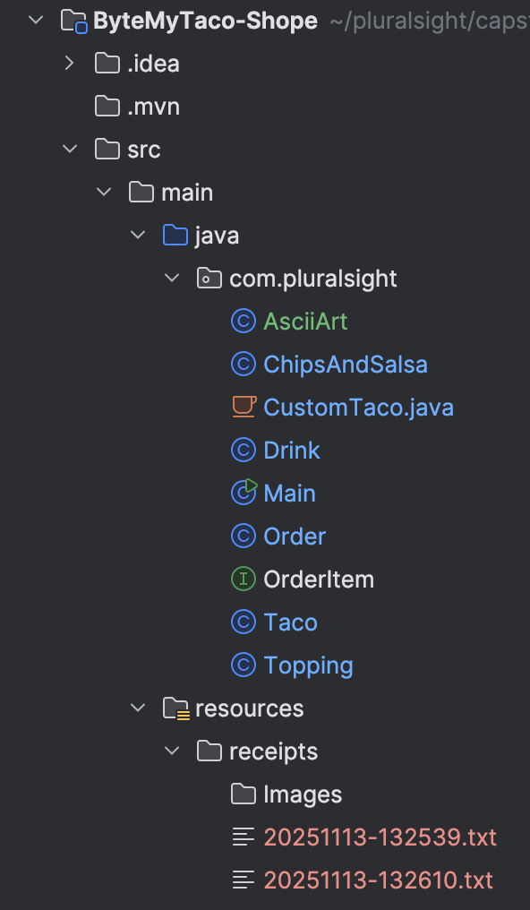

### Home Screen
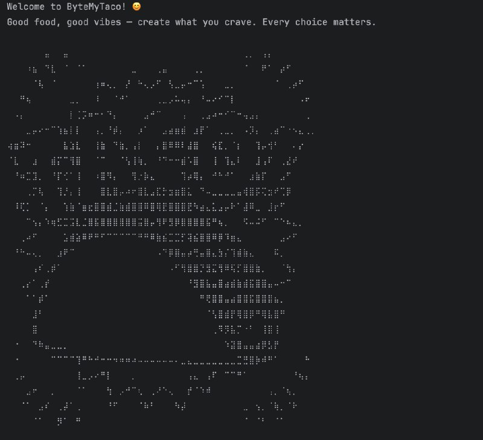

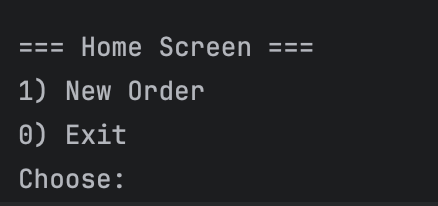
###  🌮 Taco Builder
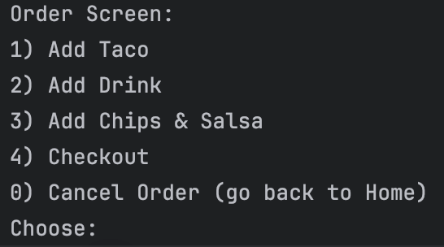

### 🌮Taco Shell
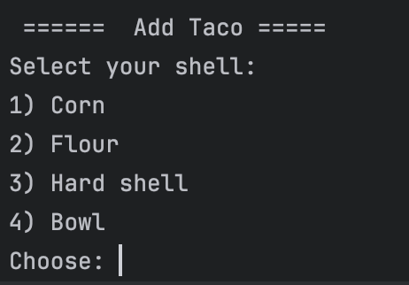

### Taco Size
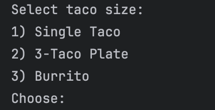

### Price(Taco), Topping, Extra Meat, Extra cheese, Drinks

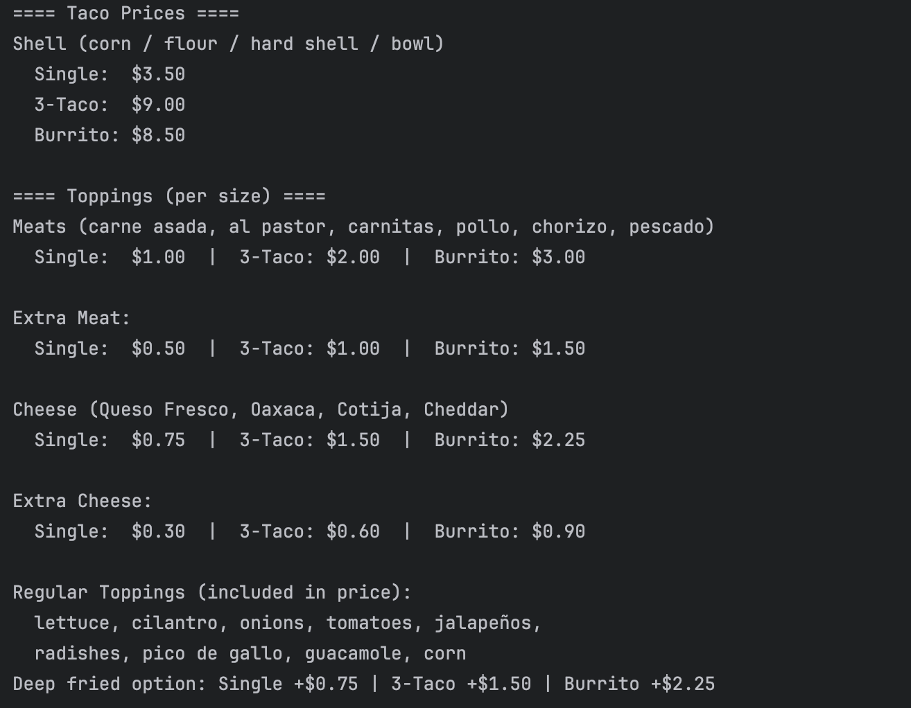

### Order before tax
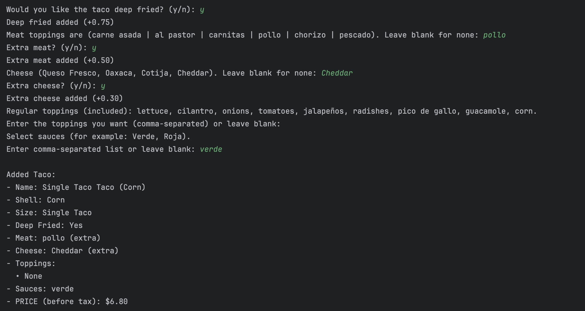

### Add Drink
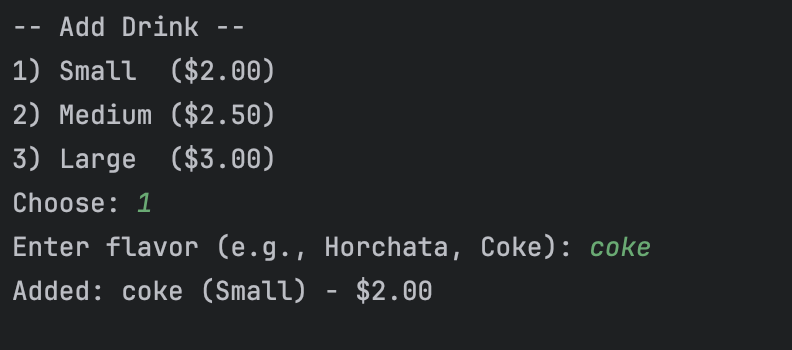
### Add Chips and Salsa
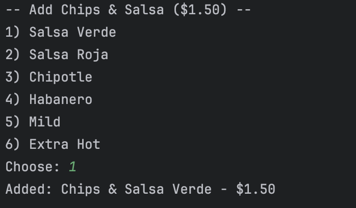
### Check out 
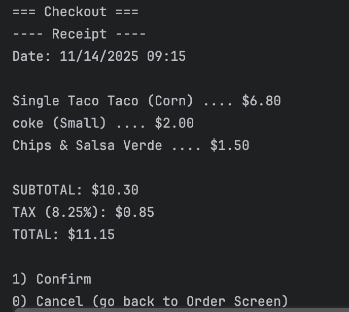

# What I have learned 
### Console Application Design
Gained experience building a structured, menu-driven console application with clear navigation flows and user-friendly prompts.

### Object-Oriented Programming (OOP)
Applied key OOP principles such as abstraction, encapsulation, and polymorphism through the use of interfaces and modular classes (OrderItem, Taco, Drink, ChipsAndSalsa, Topping, and others).

### Accurate Monetary Calculations
Used BigDecimal to handle pricing operations safely and precisely, preventing rounding errors that occur with floating-point values.

### User Input Handling and Validation
Worked extensively with the Scanner class to read and validate user input, ensuring a smooth and predictable user experience.

File Writing and Receipt Generation
Implemented automatic receipt creation using Java’s file I/O capabilities, generating timestamped receipt files for each customer order.

# What challenges i had 
Calculating different prices for toppings and extras based on taco size

Keeping the menu flow user-friendly (Home Screen → Order Screen → Taco → Drink → Chips → Checkout)

Managing the receipt format and including subtotal, tax, and total correctly

